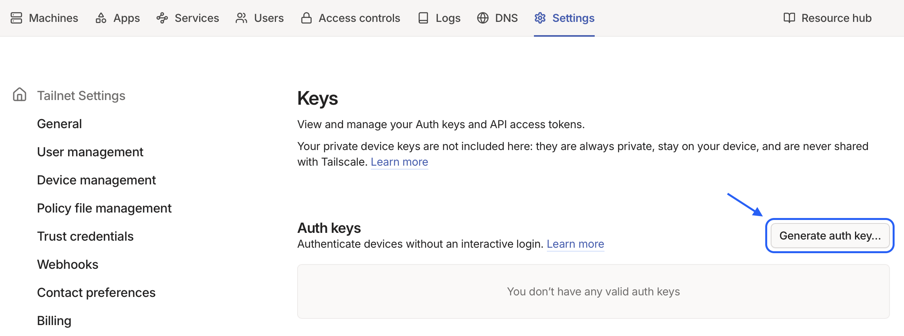
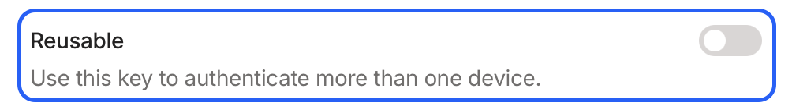
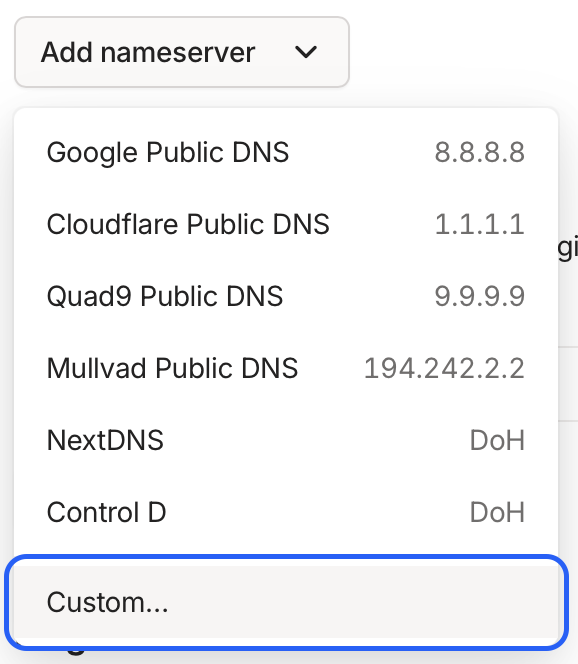
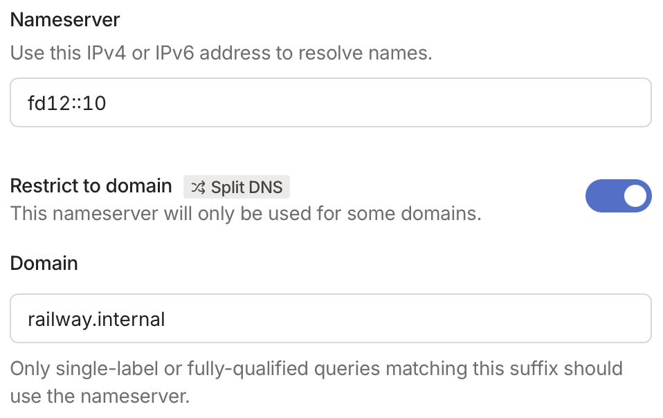

# Run a Tailscale node on Railway

Stand up a Tailscale node in 10 seconds or less (assuming instantaneous `CTRL+C CTRL+V`).
Run an exit node.
Host your own DNS.
The possibilities are endless.

[](https://railway.com/deploy/tailscale-1?referralCode=fJi8gp)

## Configuration

### Set your Tailscale authentication key

Set your Tailscale key for the variable `TS_AUTHKEY`.
You can create a new key in the [Tailscale admin console](https://login.tailscale.com/admin/settings/keys):

_Settings > Personal Settings > Keys_



I recommend using a single-use key.
This recipe will persist Tailscale's state across restarts, so there is no need to use this key more than once per environment.



### Set the Docker image version (optional)

You can pin to a specific version of the Tailscale Docker image by setting the `VERSION` variable.

```sh
VERSION="v1.92.5"  # defaults to "latest"
```

### Further customize the node configuration (optional)

You can configure the Tailscale service through any of the environment variables in the [Tailscale docs](https://tailscale.com/kb/1282/docker#parameters).

#### Serving as an exit node

To advertise an exit node, you can use `TS_EXTRA_ARGS` to add the appropriate flag when the container starts up:

```sh
TS_EXTRA_ARGS="--advertise-exit-node"
```

Be sure to also approve the exit node in the Tailscale admin console after deploying.

#### Enabling the subnet router

Your node can provide access to other services in Railway by allowing you to connect to the `railway.internal` domain.

First, have the node advertise routes for Railway's internal network CIDR range:

```sh
TS_ROUTES="fd12::/16,10.128.0.0/9"
```

Second, configure split DNS in the [Tailscale admin console](https://login.tailscale.com/admin/dns) to route DNS lookups for `railway.internal` to Railway's internal DNS server.
Use `fd12::10` as the nameserver address (used for all Railway internal routing).





Finally, be sure to approve the subnet routes in the Tailscale admin console after deploying.

You can now access `railway.internal` routes when connected to Tailscale.

## Why

I use Tailscale to tunnel in to a number of development environments.
While Railway also offers similar functionality, I prefer to just use the same tool I'm using everywhere.
And then I went overboard because I didn't like the way logs were formatted...

## Related projects & attribution

- [Tailscale Docker image](https://github.com/tailscale/tailscale/tree/main/docker)
- [Railway Tailscale subnet router template](https://docs.railway.com/tutorials/set-up-a-tailscale-subnet-router)
